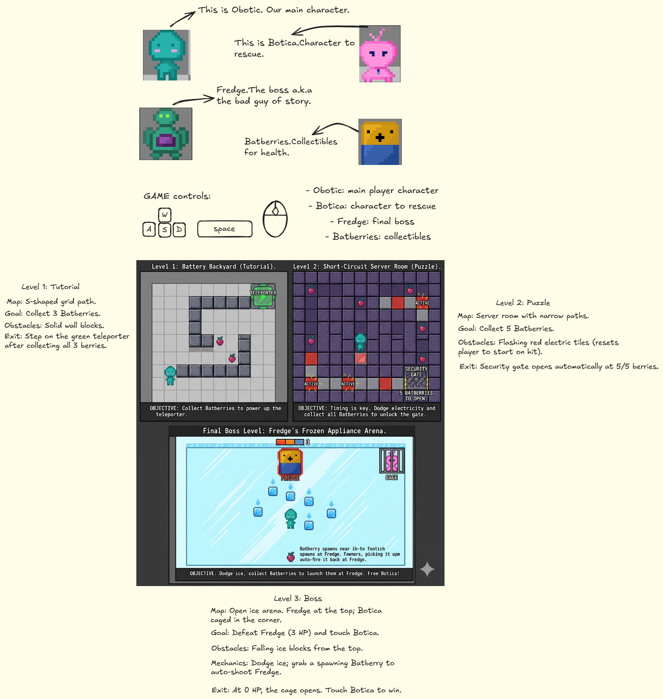

# WhereTheBotica
## Planning Sketch

https://excalidraw.com/#json=sMPndXmfCaipruKnM9nwp,K2t92aI68Bi2q2R6n2ZvrQ

## AI Usage
AI tools were used for planning, debugging, and understanding JavaScript concepts.

AI Diary:[AI_DIARY.md](./AI_DIARY.md)

## Live Demo.
You can reach to the game from the link below:
https://lalocchi.github.io/WhereTheBotica/

## Game Description

The player controls Obotic, a small robot who is trying to find Botica after she disappears from the battery field. The game has two puzzle/adventure levels and a final boss fight against Fredge.

The goal is to collect batteries, avoid obstacles, solve simple puzzles, and defeat the final boss using card-based attacks.

## Characters / Entities

- Obotic: main player character
- Botica: character to rescue
- Fredge: final boss
- Chatboi: helper chatbot in the story (Optional)
- Batberries: collectibles
- Obstacles: walls, ice blocks, danger zones
- Doors: open after completing puzzle goals (Optional)
- Cards: attack/defense options during the boss fight

## How to Play

### Controls

- Arrow keys or WASD: move Obotic
- Mouse click: choose cards during the boss fight
- Restart button: restart the game without refreshing the page

### Objective

Level 1:
- Learn movement
- Collect batteries
- Reach the exit door

Level 2:
- Solve a harder puzzle
- Avoid obstacles
- Collect required batteries or activate switches

Boss Level:
- Fight Fredge using cards
- Choose between risky and safe attacks
- Reduce Fredge’s health to zero before Obotic loses all HP

## Game Mechanics

### Movement

The player moves around the screen using keyboard input.

### Collision

The game checks collision between the player and walls, obstacles, collectibles, doors, and enemies.

### Score

The player earns score by collecting batteries and progressing through levels.

### High Score

The highest score is saved using localStorage and displayed on the screen.

### Boss Fight Card System

During the final boss fight, the player chooses cards. Each card has a different effect.

Example cards:

- Quick Zap: 5 damage with a chance of critical hit
- Heavy Hit: guaranteed 6 damage
- Battery Shield: reduces next boss attack
- Repair: restores player HP
- Overcharge: high damage but also damages the player

Main objects:

- player
- boss
- batteries
- obstacles
- cards
- levels

Main functions:

- movePlayer()
- checkCollision()
- updateGame()
- startLevel()
- playCard()
- restartGame()
- saveHighScore()

## Tech Decisions

This project uses a functional programming approach instead of OOP.

I chose the functional approach because the game is relatively small and easier to manage using objects and standalone functions. It also helped me focus on learning DOM manipulation and game logic without adding the complexity of multiple classes.

The game was built using:
- HTML
- CSS
- Vanilla JavaScript

No frameworks, libraries, or game engines were used.

## Known Bugs / Future Improvements

- Improve boss fight animations
- Add sound effects
- Improve level transitions
- Add attack cards
- Add additional levels and puzzles

## Development Milestones
- Player movement system implemented
- Collision detection implemented
- Score and lose conditions added
- Start screen and game over screen added
- Restart functionality added
- High score system implemented 